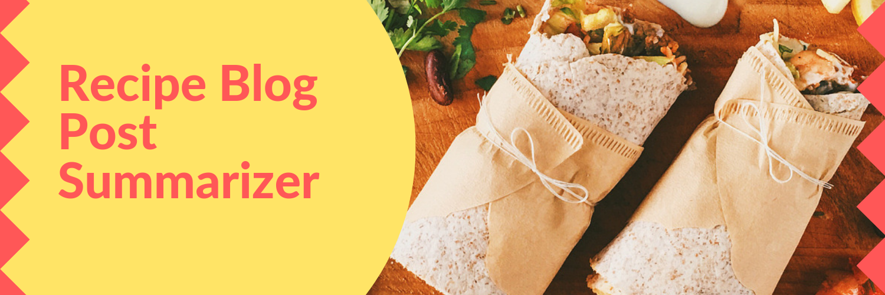
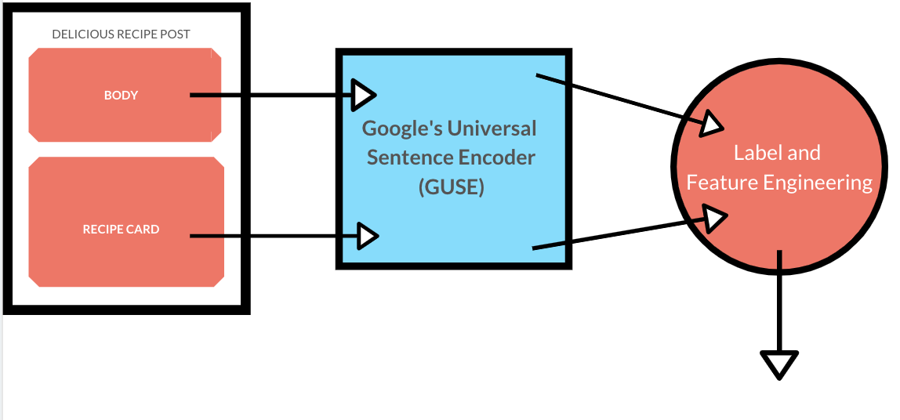
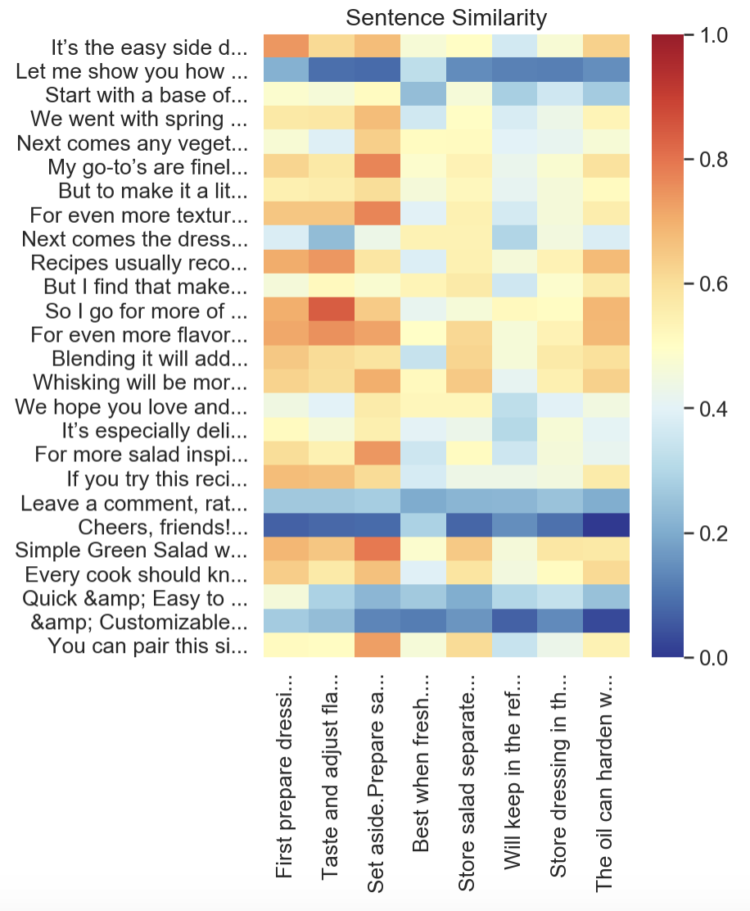
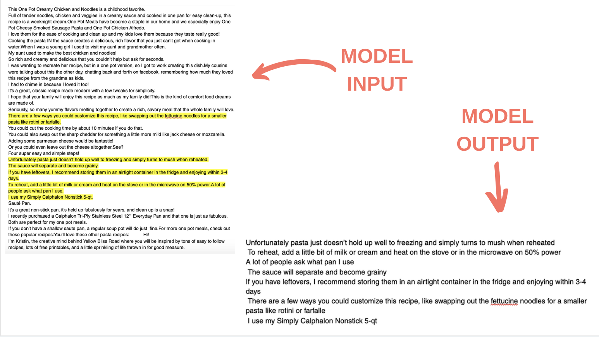
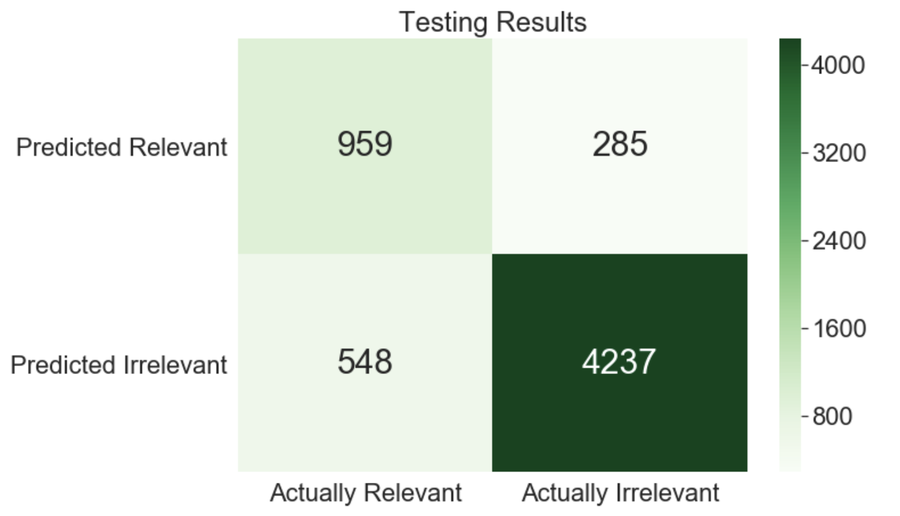

If you've ever looked for recipes online you might've come across blogs where you had to scroll through lengthy anecdotes before getting to the good stuff. My goal is to create an algorithm that will analyze all that text and return only the information that is relevant to the recipe. 

## Outline
1. The Data
2. Making it usable
3. Modeling
4. Results
5. Further Steps

## The Data
The data needed for this project doesn't exist anywhere neatly so I needed to scrape a bunch of recipe blog post from the general web. I got blog posts from some of the most popular food blogs, that are written in English. From these post I grabbed the text that made up the body of the post as well as the instructions from the recipe card at the bottom. This took some time as every blog is formatted in a slightly different way, included in this repo are a few of the scripts I used. I then had to break down each individual grab into sentence strings. Each sentence has a corresponding arbitrary post label so the body sentences and instruction sentences from the same posts can be kept together. I kept data from unique blogs in separate files to aid in train/test splitting my data later.

 
 
## Making it usable
I used Google's Universal Sentence Encoder(GUSE) to create vectorizations of every sentence. I want to capture the whole sentence rather than the words within. I tried using TFIDF vectorizations, based on inverse word frequency, but it created huge vector with less information than GUSE. GUSE also produces vectors of length 512 which is more manageable than the length of vectors produced by other sentence encoders, like Skip-Thoughts. 
 
Once I had the vectors for both the bodies and the sentences I could use cosine similarity to generate labels for the body sentences, relevant or not. In this way I defined relevance as similarity to the final recipe.

## Modeling
  I started modeling with K Nearest Neighbors. I figured that since the labelling is based on semantic similarity, a similarity based model would be a good fit. At first I was getting unreasonably good results but realized it was due to the way I was splitting my model into testing and training subsets. By randomly assigning data points (body sentences) to each subgroup I was essentially testing on sentences that came from blog posts that also appeared in my training set. I changed the way my data was stored to keep different blog sources separate. From here on a subset my testing and training sets by blog source. I trained on certain blogs and tested on others, preventing leakage. 
 
 
  In the end I found that a Logistic Regression model gave me the best results. I used the full sentence vecotrs as well as features representing the similarity of a given sentence to those immediately prior and following it.
 
 

## Results
The ultimate goal of this project is to reduce the amount of irrelevant information one reads in recipe post so I prioritzed the precision of my model when evaluationg the results. The final model had an average precision of 73%. Below is an example of a blog post before and after being put through the model.

I also took note that my validation data set was 75% "not relevant", so just predicting everything to be not relevant gave 75% accuracy. Many people do skip the entire body of a post and just look at the recipe at the bottom, so it was important that this model be an improvement on that. My model ended up with an accuracy of 86%, an 11% increase over the assumption that nothing is relevant. 

 
 

## Further Steps
I'd like to revisit the labels I've created and check them all individually. While this system is effective on a basic level I think there are refinements that can be made to filter for relevant information that is not necessarily semantically similar to the instructions. I'd like to be able to apply this model effectively to comments left by readers, as these can contain useful tips or elaborations. Right now the block to that is that a comment saying something like "I love asparagus!" on a recipe for asparagus is relevant under my current definition but is not necessarily useful. Grabbing the useful information is a task that I would like to build this project into.
